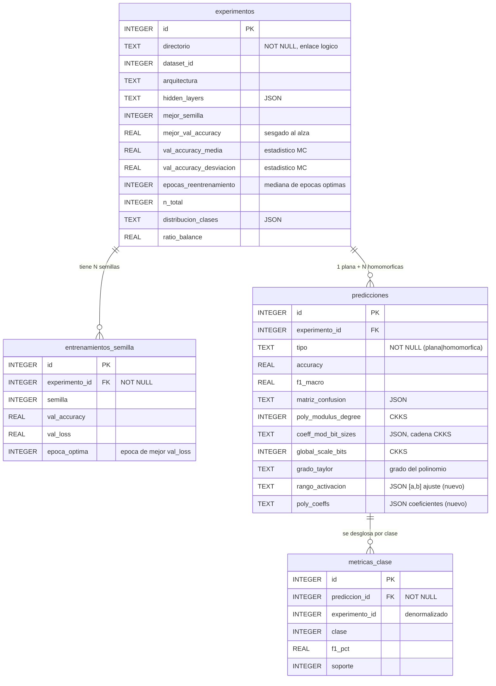

# 🗄️ Esquema de la base de datos

Documentación del esquema de `resultados/resultados.db` (SQLite), la base de
datos donde el proyecto guarda todos los resultados. Definido en
`ResultadosStore.py`. Este documento describe las tablas, sus atributos y las
relaciones entre ellas.

> **Nota:** la BD es la *fuente de verdad*; el Excel (`resultados.xlsx`) se
> regenera entero desde ella tras cada escritura. Todo lo que hay en el Excel
> proviene de estas cuatro tablas.

---

## 📐 Modelo relacional

Cuatro tablas. Un **experimento** (un entrenamiento) tiene varias **semillas**
probadas y varias **predicciones**: normalmente dos (plana + homomórfica), pero en
el **barrido CKKS** una plana y **N homomórficas**, una por configuración de
cifrado probada (grado del polinomio × escala × cadena de módulos). Cada
predicción tiene un desglose de **métricas por clase**.

### Relaciones y cardinalidades

| Relación | Cardinalidad | Clave foránea | Significado |
|----------|:------------:|---------------|-------------|
| `experimentos` → `entrenamientos_semilla` | 1 : N | `entrenamientos_semilla.experimento_id` → `experimentos.id` | Cada experimento prueba N semillas (por defecto 50). |
| `experimentos` → `predicciones` | 1 : N | `predicciones.experimento_id` → `experimentos.id` | Cada experimento genera normalmente 2 predicciones (plana + homomórfica); en las redes con **barrido CKKS** (`ejecutar_experimentos.py`) hay **N homomórficas**, una por configuración de cifrado probada. NO hay restricción UNIQUE. |
| `predicciones` → `metricas_clase` | 1 : N | `metricas_clase.prediccion_id` → `predicciones.id` | Cada predicción tiene una fila por clase (2 en binario, 7 en obesidad...). |

- Las claves primarias son siempre `id INTEGER PRIMARY KEY AUTOINCREMENT`.
- `PRAGMA foreign_keys = ON` está activado.
- `metricas_clase.experimento_id` es una copia **denormalizada** (no es clave
  foránea formal) para simplificar los cruces al generar el Excel.

---

## 🧪 Tabla `experimentos`

**Un registro por entrenamiento.** Guarda la configuración del modelo, los
hiperparámetros y las características del dataset. Es la tabla "padre".

| Columna | Tipo | Descripción |
|---------|------|-------------|
| `id` | INTEGER PK | Identificador autoincremental. |
| `fecha` | TEXT | Fecha-hora del registro (`YYYY-MM-DD HH:MM:SS`). |
| `dataset_id` | INTEGER | ID del dataset UCI (17, 891, 544, 27). |
| `dataset_nombre` | TEXT | Nombre legible del dataset. |
| `directorio` | TEXT **NOT NULL** | Carpeta del experimento (`Breast_Cancer`, `Obesity_16-10-7`...). Sirve de identificador lógico para enlazar predicciones. |
| `arquitectura` | TEXT | Arquitectura como texto, p. ej. `"5 -> 2"` o `"30 -> 16 -> 8 -> 2"`. |
| `input_size` | INTEGER | Tamaño de la capa de entrada. |
| `hidden_layers` | TEXT (JSON) | Lista de tamaños de capas ocultas, p. ej. `[16, 8]`. |
| `num_clases` | INTEGER | Número de clases de salida. |
| `pca_features` | INTEGER | Componentes PCA usados (0 = sin PCA). |
| `learning_rate` | REAL | Tasa de aprendizaje. |
| `regularizacion` | REAL | Regularización L2 (weight decay). |
| `num_semillas` | INTEGER | Nº de semillas probadas en el Monte Carlo. |
| `mejor_semilla` | INTEGER | Semilla del modelo ganador. |
| `mejor_val_accuracy` | REAL | Accuracy de validación del mejor modelo (%). Es el **criterio de selección**, por lo que está sesgado al alza: no debe usarse como estimación del rendimiento esperado (para eso están las dos columnas siguientes). |
| `val_accuracy_media` | REAL | **Media** de la accuracy de validación entre todas las semillas (%). Estimador insesgado del rendimiento del muestreo Monte Carlo. |
| `val_accuracy_desviacion` | REAL | **Desviación típica poblacional** de esa accuracy entre semillas (puntos porcentuales). Mide la estabilidad del entrenamiento frente a la partición train/val: valores altos indican que el resultado depende mucho de la semilla. |
| `epocas_reentrenamiento` | INTEGER | Épocas **fijas** del reentrenamiento final con train+val. Es la **mediana** de las épocas óptimas de las semillas (`entrenamientos_semilla.epoca_optima`); se usa la mediana por ser robusta frente a semillas atípicas. |
| `n_total` | INTEGER | Nº total de muestras del dataset (tras el cap de 20 000). |
| `n_train` | INTEGER | Muestras de entrenamiento (~70 %). |
| `n_val` | INTEGER | Muestras de validación (~10 %). |
| `n_test` | INTEGER | Muestras de test (~20 %). |
| `n_features_original` | INTEGER | Nº de características antes del PCA. |
| `distribucion_clases` | TEXT (JSON) | Recuento por clase, p. ej. `{"0": 357, "1": 212}`. |
| `ratio_balance` | REAL | Balance de clases = minoritaria / mayoritaria (1 = perfecto, →0 = desbalanceado). |
| `notas` | TEXT | Notas libres (p. ej. origen del registro). |

---

## 🌱 Tabla `entrenamientos_semilla`

**Una fila por semilla probada** dentro de un experimento. Permite ver cómo
varió la calidad del modelo entre las distintas semillas del Monte Carlo.

| Columna | Tipo | Descripción |
|---------|------|-------------|
| `id` | INTEGER PK | Identificador autoincremental. |
| `experimento_id` | INTEGER **NOT NULL**, FK → `experimentos.id` | Experimento al que pertenece. |
| `semilla` | INTEGER | Valor de la semilla. |
| `val_accuracy` | REAL | Accuracy de validación con esa semilla (%). |
| `val_loss` | REAL | Pérdida de validación con esa semilla. |
| `epoca_optima` | INTEGER | Época (1-indexada) en la que la pérdida de validación fue mínima, es decir, el estado que restaura el early stopping. La mediana de esta columna entre las semillas de un experimento fija `experimentos.epocas_reentrenamiento`. |

---

## 🔮 Tabla `predicciones`

**Una fila por evaluación.** Es la tabla central y la más ancha (~69 columnas).
Cada experimento produce normalmente dos filas: una `plana` (sin cifrar) y una
`homomorfica` (sobre datos cifrados); con el barrido CKKS hay varias `homomorfica`
(una por configuración de cifrado). Agrupo las columnas por bloques.

### Identificación

| Columna | Tipo | Descripción |
|---------|------|-------------|
| `id` | INTEGER PK | Identificador autoincremental. |
| `experimento_id` | INTEGER, FK → `experimentos.id` | Experimento evaluado. |
| `fecha` | TEXT | Fecha-hora de la predicción. |
| `tipo` | TEXT **NOT NULL** | `'plana'` o `'homomorfica'` (restringido por CHECK). |

### Rendimiento

| Columna | Tipo | Descripción |
|---------|------|-------------|
| `n_muestras` | INTEGER | Muestras evaluadas (= tamaño del test). |
| `tiempo_inferencia` | REAL | Tiempo total de inferencia (s). |
| `tiempo_por_muestra_ms` | REAL | Tiempo medio por muestra (ms). |
| `throughput` | REAL | Muestras por segundo. |

### Métricas de ML globales (tasas en **porcentaje 0-100**)

| Columna | Tipo | Descripción |
|---------|------|-------------|
| `accuracy` | REAL | Exactitud global. |
| `balanced_accuracy` | REAL | Exactitud balanceada (media de recall por clase). |
| `error_rate` | REAL | Tasa de error (100 − accuracy). |
| `precision_macro` / `_micro` / `_weighted` | REAL | Precisión en sus tres promediados. |
| `recall_macro` / `_micro` / `_weighted` | REAL | Recall (sensibilidad) en sus tres promediados. |
| `f1_macro` / `_micro` / `_weighted` | REAL | F1 en sus tres promediados. |
| `sensibilidad` | REAL | Recall de la clase positiva (binario) o recall macro (multiclase). |
| `especificidad` | REAL | Recall de la clase negativa (binario) o especificidad macro (multiclase). |
| `ppv` | REAL | Valor predictivo positivo (= precisión positiva). |
| `npv` | REAL | Valor predictivo negativo. |
| `roc_auc` | REAL | Área bajo la curva ROC. **NULL en homomórfica** (no hay probabilidades). |
| `n_correctas` / `n_incorrectas` | INTEGER | Aciertos / fallos absolutos. |
| `num_clases` | INTEGER | Nº de clases de esta evaluación. |

### Métricas de ML en rango natural (NO porcentaje)

| Columna | Tipo | Descripción |
|---------|------|-------------|
| `mcc` | REAL | Coeficiente de correlación de Matthews (−1 a 1). |
| `cohen_kappa` | REAL | Kappa de Cohen (−1 a 1). |
| `log_loss` | REAL | Pérdida logarítmica (≥ 0, menor = mejor). **NULL en homomórfica**. |

### Matriz de confusión

| Columna | Tipo | Descripción |
|---------|------|-------------|
| `tp` / `tn` / `fp` / `fn` | INTEGER | Verdaderos/falsos positivos/negativos. **Solo binario** (NULL si hay >2 clases). |
| `matriz_confusion` | TEXT (JSON) | Matriz NxN completa, p. ej. `[[70,2],[0,42]]`. |
| `metricas_clase_json` | TEXT (JSON) | Copia de las métricas por clase (mismo contenido que la tabla `metricas_clase`). |

### Parámetros del cifrado (CKKS) — solo predicciones homomórficas

| Columna | Tipo | Descripción |
|---------|------|-------------|
| `poly_modulus_degree` | INTEGER | `poly_modulus_degree` del contexto CKKS (8192/16384/32768). Se deriva de la profundidad de la red por seguridad (128 bits). |
| `coeff_mod_bit_sizes` | TEXT (JSON) | Tamaños en bits de la cadena de módulos, p. ej. `[60,31,31,31,31,31,60]`. Su longitud fija la profundidad multiplicativa. |
| `global_scale_bits` | INTEGER | Bits de la escala global (escala = 2^valor). Empíricamente irrelevante para la precisión sobre el suelo mínimo. |
| `grado_taylor` | TEXT | Grado del polinomio que aproxima la ReLU (3, 5, 7...). *Nombre histórico:* el polinomio ya no es de Taylor, se ajusta al rango real (ver `rango_activacion`/`poly_coeffs`). |
| `rango_activacion` | TEXT (JSON) | Rango `[a, b]` de las pre-activaciones medido en claro, sobre el que se ajustó el polinomio (~±8…±15, **no** [-1,1]). NULL si la red no tiene capas ocultas. |
| `poly_coeffs` | TEXT (JSON) | Coeficientes del polinomio ajustado (base de potencias ascendente `[c0..cd]`). Permite reconstruir exactamente la aproximación usada. NULL si no hay activación cifrada. |
| `batch_size` | INTEGER | Tamaño de lote pedido. |
| `batch_size_efectivo` | INTEGER | Tamaño de lote realmente usado (tras la calibración de RAM). |
| `num_workers` | INTEGER | Nº de hilos pedido. |
| `num_workers_efectivos` | INTEGER | Nº de hilos realmente usado (tras la calibración de RAM). |

### Tiempos por fase (segundos) — solo homomórficas

| Columna | Tipo | Descripción |
|---------|------|-------------|
| `tiempo_contexto` | REAL | Crear el contexto CKKS y generar claves. |
| `tiempo_cifrado` | REAL | Cifrar los datos de entrada. |
| `tiempo_prediccion` | REAL | Inferencia sobre el cifrado. |
| `tiempo_descifrado` | REAL | Descifrar el resultado. |

### Memoria — límite y vigilancia (GB)

| Columna | Tipo | Descripción |
|---------|------|-------------|
| `ram_total_wsl_gb` | REAL | RAM total visible en WSL. |
| `ram_limite_gb` | REAL | Límite de uso configurado (`--ram`, tope 12 GB). |
| `ram_pico_gb` | REAL | Pico de RAM del proceso según el control de memoria. |

### Métricas de sistema (psutil) — plana y homomórfica

| Columna | Tipo | Descripción |
|---------|------|-------------|
| `cpu_count_logico` | INTEGER | Núcleos lógicos. |
| `cpu_count_fisico` | INTEGER | Núcleos físicos. |
| `torch_threads` | INTEGER | Hilos configurados en PyTorch. |
| `hilos_pico` | INTEGER | Pico de hilos del proceso durante la inferencia. |
| `tiempo_wall_s` | REAL | Tiempo de reloj de la fase medida. |
| `cpu_time_usuario_s` | REAL | Tiempo de CPU en modo usuario. |
| `cpu_time_sistema_s` | REAL | Tiempo de CPU en modo sistema. |
| `cpu_time_total_s` | REAL | Suma usuario + sistema (todos los hilos). |
| `eficiencia_cpu` | REAL | `cpu_time_total / (wall × núcleos)`: 1.0 = usó todos los núcleos al 100 %. |
| `ram_inicial_gb` | REAL | RAM del proceso al empezar. |
| `ram_media_gb` | REAL | RAM media del proceso durante la fase. |
| `ram_pico_proceso_gb` | REAL | Pico de RAM del proceso (medido por psutil). |
| `ram_disponible_min_gb` | REAL | Mínimo de RAM disponible en el sistema alcanzado. |
| `swap_pico_gb` | REAL | Pico de swap usado. |
| `notas` | TEXT | Notas libres. |

> **Columnas NULL según el caso:** en las predicciones **planas** están vacíos
> todos los parámetros CKKS, los tiempos por fase y las columnas de límite de
> RAM (no aplican). En las **homomórficas** están vacíos `roc_auc` y `log_loss`
> (no hay probabilidades); `rango_activacion` y `poly_coeffs` van NULL además en
> redes **sin capas ocultas** (no hay activación que cifrar). `tp/tn/fp/fn` solo se
> rellenan en problemas binarios.

---

## 🎯 Tabla `metricas_clase`

**Una fila por clase de cada predicción** (formato largo). Permite analizar el
rendimiento clase a clase, útil sobre todo en multiclase (obesidad, 7 clases).

| Columna | Tipo | Descripción |
|---------|------|-------------|
| `id` | INTEGER PK | Identificador autoincremental. |
| `prediccion_id` | INTEGER **NOT NULL**, FK → `predicciones.id` | Predicción a la que pertenece. |
| `experimento_id` | INTEGER | Copia denormalizada del experimento (para cruces rápidos). |
| `tipo` | TEXT | `'plana'` o `'homomorfica'` (copiado de la predicción). |
| `clase` | INTEGER | Índice de la clase (0, 1, ..., n−1). |
| `precision_pct` | REAL | Precisión de esa clase (%). |
| `recall_pct` | REAL | Recall de esa clase (%). |
| `f1_pct` | REAL | F1 de esa clase (%). |
| `especificidad_pct` | REAL | Especificidad de esa clase, one-vs-rest (%). |
| `soporte` | INTEGER | Nº de muestras reales de esa clase en el test. |

---

## 📋 Convenciones y notas de diseño

- **Unidades:** las tasas (`accuracy`, `f1_*`, `precision_*`, `recall_*`,
  `roc_auc`, y las `*_pct`) se guardan en **porcentaje (0-100)**. `mcc` y
  `cohen_kappa` en su rango natural (−1 a 1). `log_loss` en bruto. Los tiempos
  en **segundos** (salvo `tiempo_por_muestra_ms`, en ms). La memoria en **GB**.
- **Columnas JSON:** `hidden_layers`, `distribucion_clases`, `coeff_mod_bit_sizes`,
  `rango_activacion`, `poly_coeffs`, `matriz_confusion` y `metricas_clase_json`
  guardan estructuras serializadas como texto JSON (SQLite no tiene tipo lista/array).
- **Enlace lógico por `directorio`:** cuando se evalúa sin reentrenar, el
  experimento se recupera (o reconstruye) buscando por el campo `directorio`,
  que se normaliza al nombre base de la carpeta.
- **Estadísticos del muestreo Monte Carlo:** el entrenamiento prueba N semillas y
  se queda con la mejor por accuracy de validación. Como esa selección introduce
  un sesgo optimista, la BD guarda además la **media** y la **desviación típica**
  entre semillas (`val_accuracy_media`, `val_accuracy_desviacion`), que son los
  estadísticos que describen de verdad el rendimiento y su estabilidad.
- **Épocas del reentrenamiento final:** el modelo ganador se reentrena con
  train+val, conjunto en el que ya no queda validación con la que aplicar early
  stopping. Para no detenerse por la pérdida de *entrenamiento* (que siempre
  baja, lo que llevaría a sobreajustar), el número de épocas se fija de antemano
  a la **mediana** de las épocas óptimas observadas en el muestreo
  (`entrenamientos_semilla.epoca_optima` → `experimentos.epocas_reentrenamiento`).
- **Sin restricción UNIQUE en `directorio`:** volver a ejecutar un experimento
  inserta una **fila nueva** en `experimentos` en lugar de actualizar la
  existente, de modo que el histórico se conserva. Por eso puede haber varios
  registros con el mismo `directorio`. Conviene tenerlo presente al explotar los
  datos: tanto la comparativa de la web como la del Excel agrupan por
  `experimentos.id`, no por `directorio`, así que cada re-ejecución aparece como
  una entrada independiente. Para quedarse solo con la última de cada directorio
  hay que filtrar explícitamente (`MAX(id) GROUP BY directorio`).
- **Migración automática:** al abrir una BD antigua, `ResultadosStore._migrar`
  añade con `ALTER TABLE` cualquier columna que falte, sin perder los datos
  existentes. Por eso registros antiguos pueden tener a NULL las columnas de
  métricas añadidas después (es el caso de las cuatro columnas de épocas y
  estadísticos, ausentes en los experimentos anteriores a su introducción).
- **Portabilidad:** se usa SQL estándar; el esquema es trasladable a
  MySQL/PostgreSQL si en el futuro se define una base de datos de servidor.
